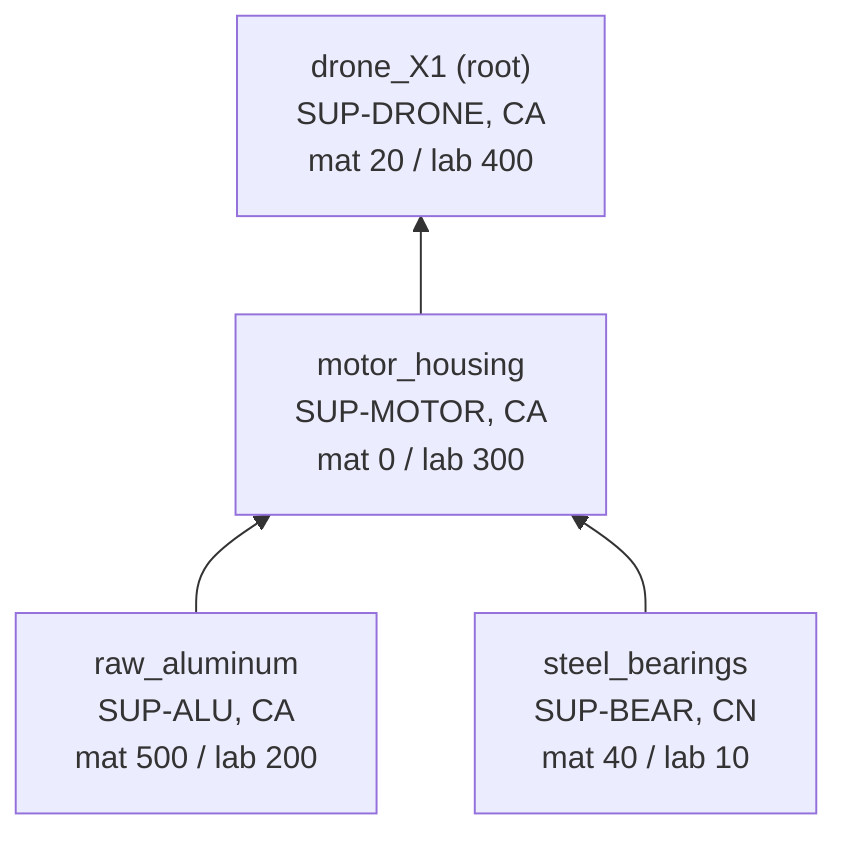
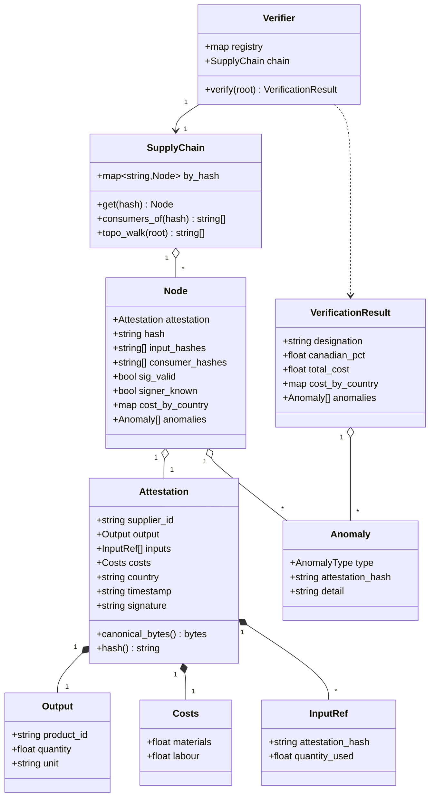
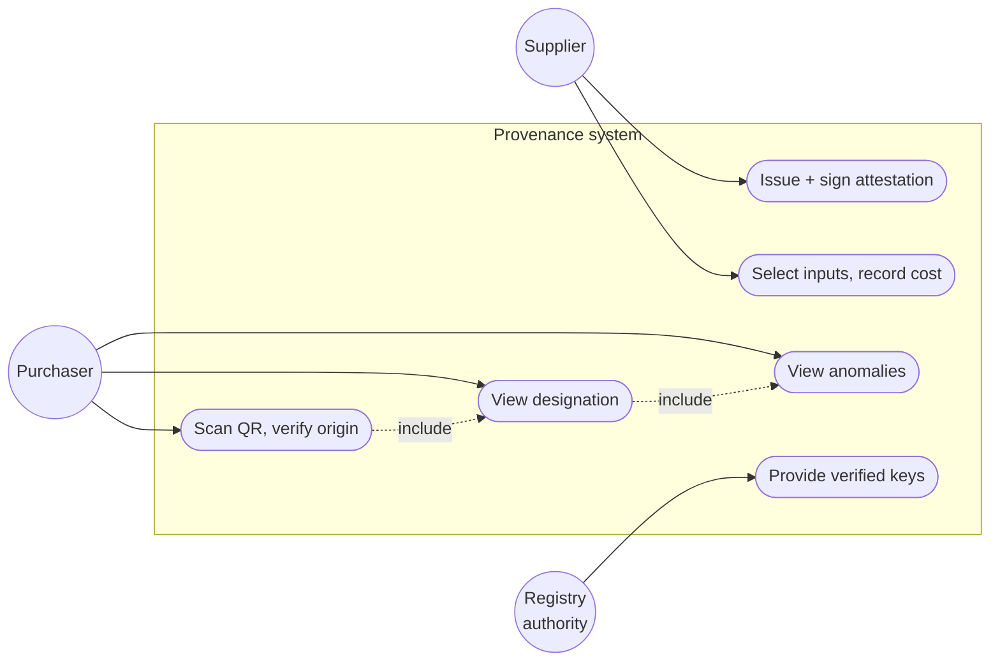
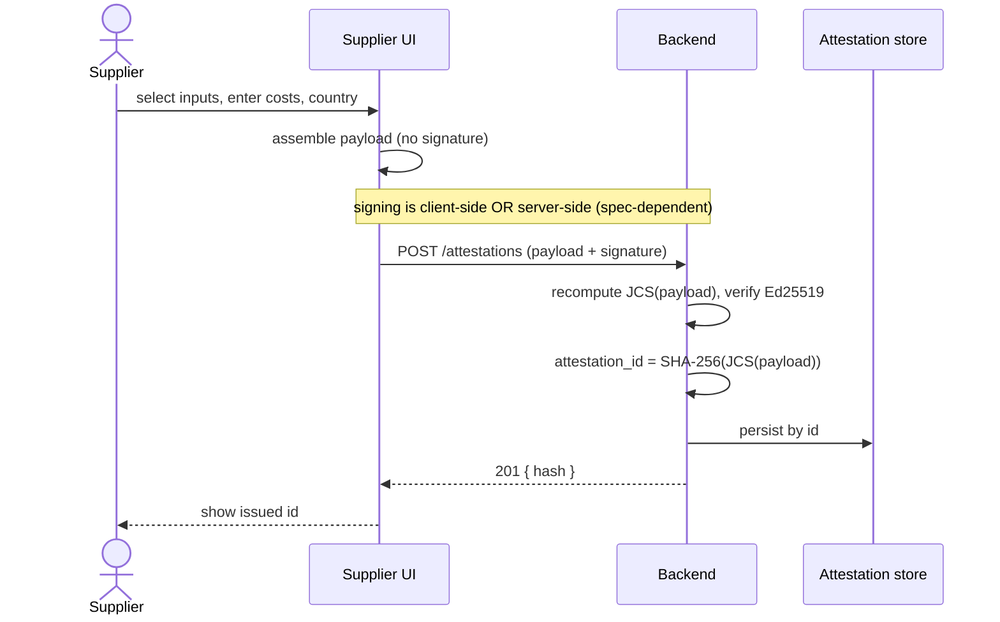
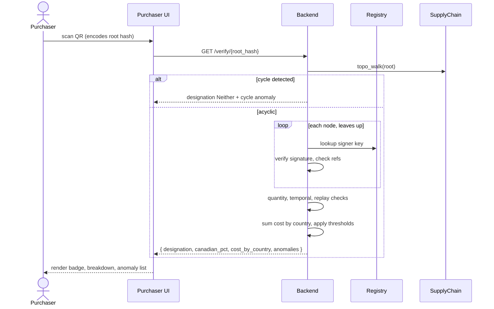
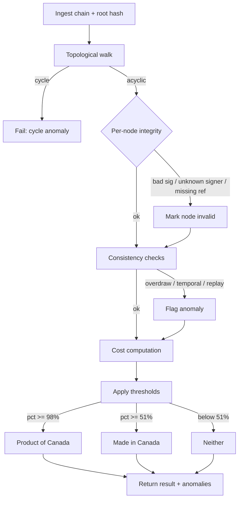
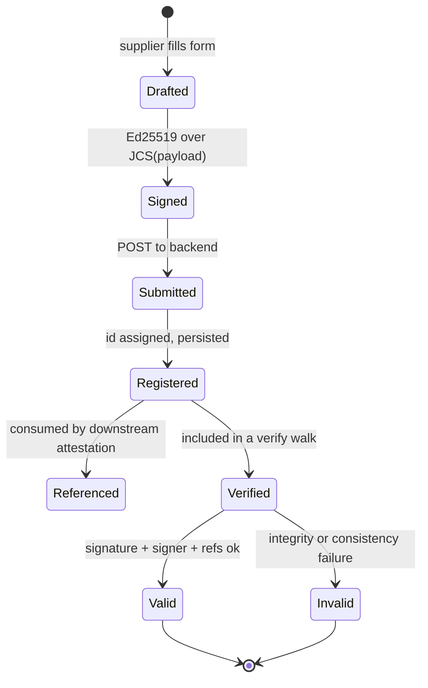
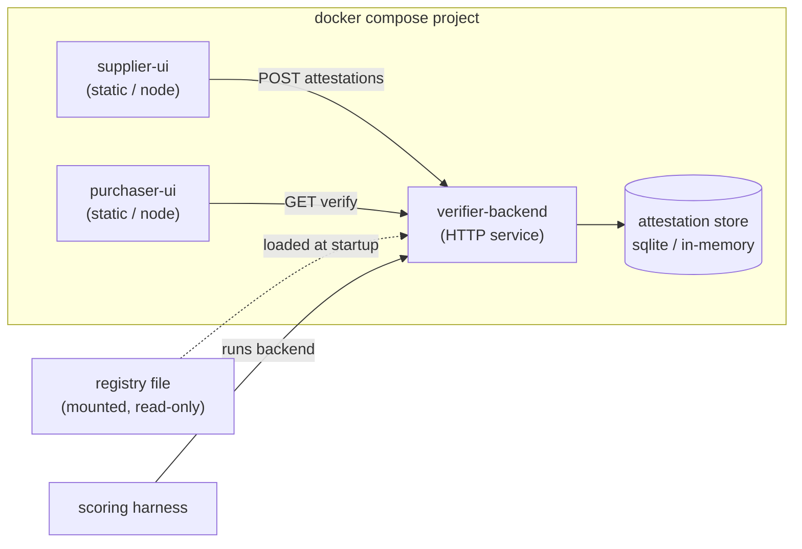

# Cryptographic Provenance: System Design

Design reference for the Canadian supply chain provenance hackathon. All diagrams use Mermaid and render natively in GitLab and on GitHub.

Scope note: this is a pre-event design. The event-day spec defines the exact attestation schema, canonical serialization, and cost rules; sections marked "spec-dependent" are the parts to revisit once that lands.

## Contents

1. Problem summary
2. Hash function and content addressing
3. Domain model (the attestation DAG)
4. Data model (class diagram)
5. Use case diagram
6. Sequence diagrams (issue, verify)
7. Verification pipeline (activity diagram)
8. Attestation lifecycle (state diagram)
9. Anomaly taxonomy
10. Canadian content rules
11. API contract
12. Deployment (component diagram)
13. Build priorities

---

## 1. Problem summary

Suppliers across a multi-tier chain each sign a structured record (an attestation) of what they produced, what they consumed, the cost split between materials and labour, and the country of work. Each attestation references the ones it consumed, forming a directed acyclic graph from raw materials (leaves) to finished product (root). A verifier walks the graph, checks every signature, sums costs by country, applies the Competition Bureau thresholds, and reports anomalies.

The scored deliverable is the backend. The two web UIs (supplier, purchaser) count toward the demo but are not auto-scored.

---

## 2. Hash function and content addressing

```
attestation_id = hex( SHA-256( JCS(payload) ) )
```

where `payload` is the attestation object with the `signature` field removed, and `JCS` is the JSON Canonicalization Scheme (RFC 8785): sorted keys, no insignificant whitespace, normalized number and string encoding, UTF-8 output. The result is a 64-character lowercase hex string used as both the content address and the integrity anchor.

Rationale:

- SHA-256 is collision- and preimage-resistant with no practical breaks, so no forged attestation can collide with a trusted id.
- It is the standard across in-toto, SLSA, and C2PA, so ids match the reference library's.
- Speed-optimized alternatives (BLAKE3) gain nothing at tens-of-nodes scale and cost interop; broken functions (MD5, SHA-1) are disqualified by known collisions.

Signing detail: Ed25519 hashes its message internally (SHA-512), so you sign `JCS(payload)` directly. Do not pre-hash then sign the digest.

Integrity chain (one tamper, two independent detections):

```
tamper any field
  -> JCS(payload) changes
    -> attestation_id changes
       -> downstream input references dangle   (missing-reference anomaly)
       -> Ed25519 signature fails to verify    (bad-signature anomaly)
```

Uniqueness caveat (spec-dependent): the id excludes the signature, so byte-identical payloads collapse to one id. If distinct physical lots must be distinguishable, the payload must carry a precise timestamp or an explicit `lot_id` / `nonce`.

---

## 3. Domain model (the attestation DAG)

Example: a drone assembled in Canada from a Canadian motor housing, which used Canadian aluminum and imported bearings.



Edges point from input to consumer (leaves up to root). Cost computation walks this direction; quantity-overdraw checks walk the reverse (a node asks who consumed it and how much in total).

---

## 4. Data model (class diagram)

Two things kept deliberately separate: the immutable signed `Attestation`, and the mutable `Node` the verifier wraps around it. Annotating the signed object in place would change its hash and break references.



Key choices: graph stored as `map<hash, Node>` for O(1) reference resolution; bidirectional edges (`input_hashes` and `consumer_hashes`) built in one pass at construction; inputs stored as hashes, not object pointers, so a dangling edge is representable data rather than a crash.

---

## 5. Use case diagram

Mermaid has no native use case notation, so actors are circles and use cases are rounded nodes inside the system boundary.



The registry authority has no UI of yours; on event day it arrives as a fixed data file (mock verified identities and keys) that the backend treats as read-only ground truth. The two include relationships mean one `verify` call returns designation and anomalies together, not as separate requests.

---

## 6. Sequence diagrams

### 6.1 Supplier issues an attestation



### 6.2 Purchaser verifies a product



---

## 7. Verification pipeline (activity diagram)



Behavioural contract: a cycle is fatal because the graph cannot be traversed. Integrity failures exclude a node from the cost sum but do not halt the run. Consistency issues are flagged while still producing a usable answer. This graceful degradation is what the "handle incomplete data without falling over" scoring criterion rewards.

---

## 8. Attestation lifecycle (state diagram)



---

## 9. Anomaly taxonomy

| Category | Type | Detection | Severity |
|---|---|---|---|
| Integrity | `bad_signature` | Ed25519 verify fails on canonical bytes | node invalid |
| Integrity | `unknown_signer` | supplier_id not in registry | node invalid |
| Structural | `missing_reference` | referenced input hash absent from chain | node invalid |
| Structural | `cycle` | back-edge found during topo walk | chain fatal |
| Consistency | `quantity_overdraw` | sum consumed across consumers > produced | flag |
| Consistency | `temporal_inversion` | input timestamp later than consumer | flag |
| Replay | `replay` | same input claimed across chains that should not share it | flag (spec-dependent) |
| Data | `missing_field` | required field absent | flag, degrade gracefully |

Replay detection depends on whether the spec provides a product or lot id on outputs; with one it is a local check, without one it needs inference.

---

## 10. Canadian content rules

| Designation | Cost threshold (CA) | Last substantial transformation |
|---|---|---|
| Product of Canada | at least 98% of direct production costs | in Canada |
| Made in Canada | at least 51% of direct production costs | in Canada |
| Neither | below 51% | n/a |

Direct production costs are materials plus labour. Costs accumulate through tiers and each must be attributed to the country where the work happened. A Canadian assembler using imported components contributes Canadian labour; the imported material cost flows through with its own country attribution. Exact cost-flow rules and the definition of "substantial transformation" from attestation data are spec-dependent.

---

## 11. API contract

| Method | Path | Body / param | Returns |
|---|---|---|---|
| POST | `/attestations` | attestation JSON (payload + signature) | `{ hash }` |
| GET | `/verify/{root_hash}` | root hash | `VerificationResult` |
| GET | `/health` | none | `{ status }` |

`VerificationResult` shape:

```json
{
  "designation": "Product of Canada",
  "canadian_pct": 0.986,
  "total_cost": 1440.0,
  "cost_by_country": { "CA": 1420.0, "CN": 20.0 },
  "anomalies": [
    { "type": "quantity_overdraw", "attestation_hash": "a3f1...", "detail": "consumed 7 > produced 5" }
  ]
}
```

Lock this contract before writing verification logic; the scoring harness calls a fixed interface.

---

## 12. Deployment (component diagram)



The harness runs every team's backend the same way through Docker Compose, so the backend service name, port, and run command must match the spec exactly. Pin all dependency versions and document the run command in the README.

---

## 13. Build priorities

1. Lock the I/O contract and canonical serialization. Confirm your `JCS(payload)` bytes match the reference library before anything else; a mismatch fails every signature.
2. Health endpoint and Compose running end-to-end before any verification logic.
3. Happy-path verification against the provided sample chains.
4. Anomalies in order of difficulty: signatures and missing fields first, then quantity accounting, then replay and structural.
5. Graceful degradation on incomplete data.
6. The two UIs, minimal but functional, for the demo.
7. Clean-clone test through the self-test harness.

Effort split: roughly 70% backend correctness and anomaly detection, 20% UIs, 10% packaging and documentation.
